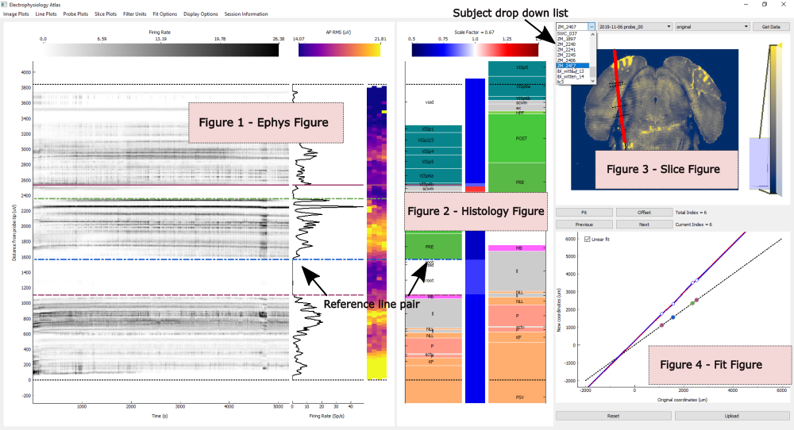

# IBL Ephys Alignment GUI



A PyQt5/pyqtgraph workstation for aligning electrophysiology features to a
histology probe track. This AIND fork consumes preprocessed mouse-level
datapackages, supports multi-session and multi-shank annotation, preserves work
across navigation, and writes mouse-level alignment output packages.

The original IBL workflow documentation is available on the
[`iblapps` wiki](https://github.com/int-brain-lab/iblapps/wiki). This fork's data
loading, output packaging, autosave, and multi-probe behavior differ from that
legacy application.

## Install And Run

Install from GitHub:

```bash
pip install git+https://github.com/AllenNeuralDynamics/ibl-ephys-alignment-gui.git
launch
```

For development, use `uv`:

```bash
uv sync --group dev
uv run launch
uv run ruff check src tests
uv run pytest -q
```

The GUI runs in preprocessed-datapackage mode. ONE/Alyx online mode is not
supported; the legacy command-line flags remain only for compatibility.

## Basic Workflow

1. Choose a mouse-root directory containing `datapackage.json`.
2. Choose a recording session. The probe selector intentionally remains blank
   until you choose the stream you want to load.
3. Choose a probe/stream. Data load automatically; select a shank if the stream
   contains more than one.
4. Add and adjust paired reference lines, then use Fit to commit a warp edit.
5. Choose an output root and Save. Save writes every saveable alignment in the
   document, including visited initialized alignments and alignments imported
   from a previous output package.

The GUI caches up to three loaded streams by default and speculatively preloads
the next probe in the same session. Changing mouse root clears mouse-scoped
runtime data; navigation within the same mouse preserves document edits and
useful cached runtimes.

Use the load-previous-alignments action to select a mouse-level annotation
package and import alignments across its recording/probe/shank hierarchy.
Existing dirty work is not silently overwritten.

## Output And Recovery

Each GUI session writes under one Code Ocean-friendly mouse-level directory:

```text
<output-root>/ibl_annotations_<mouse-id>_<timestamp>/
    datapackage.json
    autosave/alignment_document.json
    <recording-id>/<probe-name>/
        channel_locations*.json
        ccf_channel_locations*.json
        prev_alignments*.json
        alignment_output_metadata*.json
```

Autosave is a lightweight document checkpoint. It records alignment state and
history but does not run ephys loading or ANTs transforms. To recover after an
interrupted session:

1. load the matching mouse root;
2. choose `File -> Recover Autosave...`;
3. select the checkpoint file, its `autosave` directory, or the containing
   annotation-package directory;
4. review and confirm the recovery summary.

Recovery validates the mouse and available stream/shank keys. A successful full
Save clears the current autosave checkpoint.

Full Save batches CCF transforms across all saveable alignments. If derived CCF
export is unsafe or fails, the GUI preserves alignment history and anatomical
channel locations, records the CCF status in per-shank metadata, and displays a
warning.

## Code Ocean Configuration

Recommended environment variables:

```bash
EPHYS_ALIGNMENT_INPUT_ROOT=/data
EPHYS_ALIGNMENT_OUTPUT_ROOT=/results
EPHYS_ALIGNMENT_MAX_CACHED_STREAMS=3
IBL_ASSET_ROOTS=/data
```

- `EPHYS_ALIGNMENT_INPUT_ROOT` sets the initial mouse-root dialog directory.
- `EPHYS_ALIGNMENT_OUTPUT_ROOT` sets the default root under which a new
  `ibl_annotations_*` package is created.
- `EPHYS_ALIGNMENT_MAX_CACHED_STREAMS` sets the loaded-stream LRU limit. The
  default is `3`; `unbounded` disables the limit.
- `IBL_ASSET_ROOTS` is an `os.pathsep`-separated search path for external assets
  referenced by `datapackage.json`, such as SmartSPIM registration data and
  `spim_template_to_ccf`.

The path variables are startup defaults; the GUI can select other locations.

If an attached asset is not mounted under its recorded name, use
`IBL_ASSET_CONFIG`:

```bash
IBL_ASSET_CONFIG=/data/asset_config.json
```

with:

```json
{
  "asset_roots": ["/data"],
  "asset_overrides": {
    "smartspim": "/data/SmartSPIM_...",
    "spim_template_to_ccf": "/data/spim_template_to_ccf"
  }
}
```

Alternatively, set `IBL_ASSET_OVERRIDES` to a JSON object containing the same
`asset_overrides` mapping. Override keys may be logical datapackage asset keys
or recorded asset names.

For load/switch performance traces, set:

```bash
EPHYS_ALIGNMENT_GUI_TIMING=1
```

This logs timed load, preload, payload preparation, slice preparation, and
desktop rendering phases. Leave it unset during normal use.

ANTs point transforms run in a cancellable subprocess by default. Set
`EPHYS_ALIGNMENT_ANTS_POINTS_SUBPROCESS=0` only for diagnosis; in-process ANTs
calls cannot be interrupted until the native operation returns.

## Input Contract

The selected mouse root must contain an AIND IBL ephys alignment
`datapackage.json`. The GUI supports schema majors 3 and 4 and ships validation
schemas for versions 3.0.0, 3.1.0, 3.2.0, 4.0.0, and 4.1.0. It uses the
datapackage hierarchy as the source of recording/probe identity; it does not
infer sessions by scanning directories.

## Keyboard Shortcuts

Every shortcut is also shown in the GUI menu bar. The menu construction in
`src/ephys_alignment_gui/desktop/shell/menu_setup.py` is authoritative.

### Alignment

| Shortcut | Action |
|---|---|
| `Enter` | Fit and commit the interpolation from current reference lines |
| `O` | Offset from the current probe-tip position |
| `Shift+Up` / `Shift+Down` | Offset by +/-50 micrometers |
| `Shift+D` | Delete the hovered reference-line pair |
| `Left` | Previous committed edit (undo) |
| `Right` | Next committed edit (redo) |
| `Ctrl+R` | Reset to initialized geometry and clear pending lines |
| `Ctrl+S` | Save all saveable alignments |

### Display

| Shortcut | Action |
|---|---|
| `Alt+1` / `Alt+2` / `Alt+3` / `Alt+4` | Next Image / Line / Probe / Slice plot |
| `Alt+Ctrl+1` ... `Alt+Ctrl+4` | Previous Image / Line / Probe / Slice plot |
| `Shift+1` / `Shift+2` / `Shift+3` | Switch panel layout |
| `Shift+A` | Reset axes |
| `Shift+L` | Hide/show region labels |
| `Shift+H` | Hide/show reference lines |
| `Shift+C` | Hide/show channels |
| `Shift+N` | Hide/show nearby boundaries |
| `Shift+M` | Change histology annotation map |
| `Alt+M` / `Alt+X` | Minimize/show or close cluster popups |
| `Ctrl+Shift+S` | Export active-shank plots |
| `Shift+I` | Show region information |

Committed alignment edits form a per-shank linear undo/redo history. Placing or
dragging reference lines changes pending state; Fit or Offset commits an edit.
Reset returns the active shank to initialized geometry rather than the most
recent loaded alignment.

## Developer Documentation

- `CONTRIBUTING.md`: development workflow, required checks, change placement,
  testing expectations, and commit guidance.
- `docs/architecture.md`: current ownership, lifecycle, threading, plotting,
  save, and extension contracts.
- `docs/reference_line_alignment_contract.md`: coordinate spaces and fitting
  invariants.
- `TODO.md`: open correctness and product work only.
- `CLAUDE.md`: concise agent/contributor operating guide.
- `AGENTS.md`: tool-neutral entry point for coding agents.
